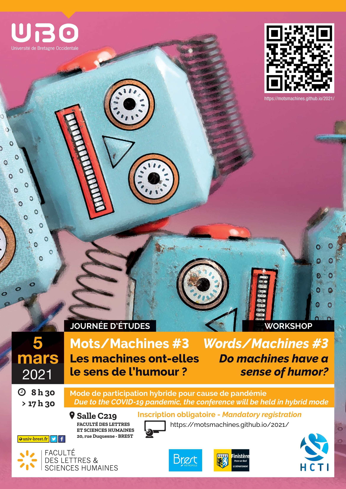

# Mots/Machines #3
 

[Home](https://motsmachines.github.io/2021/EN) | [Call for Papers](https://motsmachines.github.io/2021/EN/cfp) | [Program](https://motsmachines.github.io/2021/EN/program) | [Organizers](https://motsmachines.github.io/2021/EN/orga) | [Registration](https://motsmachines.github.io/2021/EN/registration) | 

  

# Words/Machines-2021: Do machines have a sense of humor?

## Venue
The workshop will be held at the University of Western Brittany, Faculty of Arts:

BREST Faculté Victor Segalen

20, rue Duquesne - CS9383729238

Brest Cedex 3, France

Due to the current COVID-19 pandemic, Mots-Machines will also propose ONLINE participation.

## Contact

Website: https://motsmachines.github.io/2021/ 

All questions about submissions should be emailed to mots.machines@gmail.com
