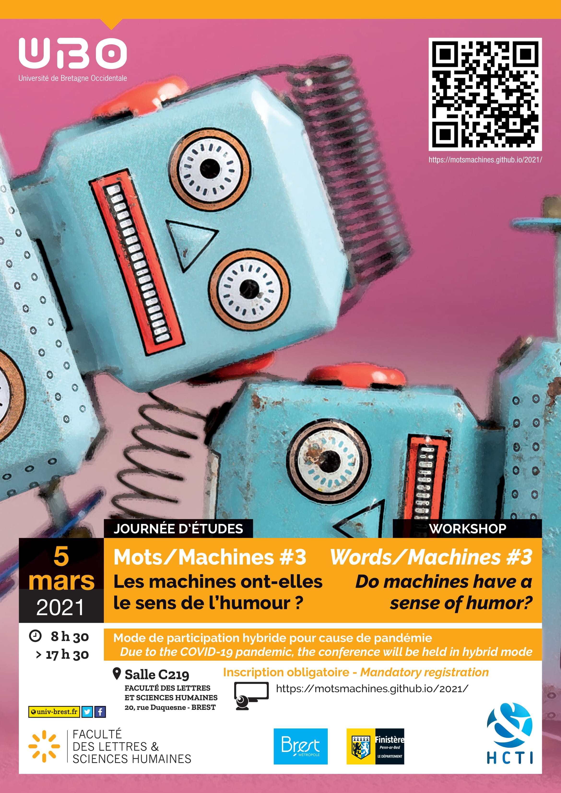

# Mots/Machines #3
 

[Accueil](https://motsmachines.github.io/2021/fr) | [Participations](https://motsmachines.github.io/2021/fr/cfp) | [Programme](https://motsmachines.github.io/2021/fr/program) | [Organisation](https://motsmachines.github.io/2021/fr/orga) | [S'inscrire](https://motsmachines.github.io/2021/fr/registration) | 

 

## Les machines ont-elles le sens de l'humour ?

## Lieu et accès
BREST Faculté Victor Segalen

20, rue Duquesne - CS9383729238

Brest Cedex 3, France

Nous encourageons également la participation en ligne au vu de la situation sanitaire.

## Contacts

[Site Web 2019](https://motsmachines.github.io/2019)

[Site Web 2020](https://motsmachines.github.io/2020)

[Site Web 2021](https://motsmachines.github.io/2021)

E-mail : [mots.machines@gmail.com](mailto:mots.machines@gmail.com)

## Objectifs
	
Créer un lieu de dialogue entre les informaticiens, les linguistes et les traducteurs

Promouvoir la recherche dans le milieu des étudiants

Initier des collaborations éventuelles
